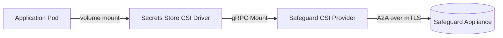

# Safeguard CSI Provider

A provider for the [Kubernetes Secrets Store CSI Driver](https://secrets-store-csi-driver.sigs.k8s.io/)
that retrieves credentials from [One Identity Safeguard for Privileged
Passwords](https://www.oneidentity.com/products/safeguard-for-privileged-passwords/)
and mounts them into pods as files.

Credentials are retrieved over Safeguard's Application-to-Application (A2A)
service using the [safeguard-go](https://github.com/OneIdentity/safeguard-go)
SDK. Authentication is performed with a client certificate; no user password or
long-lived bearer token is stored in the cluster.

## How it works



1. A pod references a `SecretProviderClass` and mounts a `secrets-store.csi.k8s.io`
   volume.
2. The CSI driver calls this provider's gRPC `Mount` endpoint with the class
   attributes and the node-publish secret (the client certificate and key).
3. The provider builds an A2A context with the client certificate, enumerates the
   accounts the certificate is registered to retrieve, filters them by `appName`,
   and retrieves each account's credential.
4. Each credential is written to the pod's mount as a file named after the
   account.

## SecretProviderClass attributes

| Attribute | Required | Default | Description |
| --- | --- | --- | --- |
| `safeguardHost` | yes | — | Hostname of the Safeguard appliance (e.g. `safeguard.example.com`). |
| `appName` | no | *(all)* | A2A registration application name to filter accounts by. When empty, every account the certificate can retrieve is mounted. |
| `objectType` | no | `Password` | Credential type to retrieve: `Password`, `PrivateKey`, or `ApiKey`. Applies to all matched accounts. |
| `keyFormat` | no | `OpenSsh` | SSH private-key format when `objectType: PrivateKey`: `OpenSsh`, `Ssh2`, or `Putty`. |
| `safeguardCaBundle` | no | *(system roots)* | PEM CA bundle used to verify the appliance certificate. Set this when the appliance uses a privately issued certificate. |
| `insecureSkipVerify` | no | `false` | When `true`, disables verification of the appliance certificate. **Intended for bootstrapping only — do not use in production.** |

### Node-publish secret

The client certificate and its private key are supplied through the CSI driver's
`nodePublishSecretRef` as two keys:

| Key | Description |
| --- | --- |
| `clientCertificate` | PEM-encoded client certificate (leaf plus any intermediates). |
| `clientKey` | PEM-encoded private key for the client certificate. |

Only PEM material is accepted. If your certificate is in PKCS#12 (`.pfx`/`.p12`),
convert it first:

```bash
openssl pkcs12 -in client.pfx -clcerts -nokeys -out clientCertificate.pem
openssl pkcs12 -in client.pfx -nocerts -nodes -out clientKey.pem
```

## Output

Each retrieved account produces one file in the mount, named after the account:

- `objectType: Password` — the file contains the plaintext password.
- `objectType: PrivateKey` — the file contains the SSH private key in the
  requested `keyFormat`.
- `objectType: ApiKey` — the file contains a JSON array of the account's API key
  credentials (`id`, `name`, `description`, `clientId`, `clientSecret`,
  `clientSecretId`).

## Example

Create the node-publish secret from your client certificate and key:

```bash
kubectl create secret generic safeguard-a2a \
  --from-file=clientCertificate=clientCertificate.pem \
  --from-file=clientKey=clientKey.pem
kubectl label secret safeguard-a2a secrets-store.csi.k8s.io/used=true
```

Define a `SecretProviderClass` (see [`examples/`](./examples)):

```yaml
apiVersion: secrets-store.csi.x-k8s.io/v1
kind: SecretProviderClass
metadata:
  name: safeguard
spec:
  provider: safeguard
  parameters:
    safeguardHost: safeguard.example.com
    appName: my-application
    objectType: Password
    # safeguardCaBundle: |
    #   -----BEGIN CERTIFICATE-----
    #   ...appliance issuing CA...
    #   -----END CERTIFICATE-----
```

Mount it into a pod:

```yaml
volumes:
  - name: secrets
    csi:
      driver: secrets-store.csi.k8s.io
      readOnly: true
      volumeAttributes:
        secretProviderClass: safeguard
      nodePublishSecretRef:
        name: safeguard-a2a
```

## Installation

The provider runs as a `DaemonSet` alongside the Secrets Store CSI Driver. Install
with the bundled Helm chart:

```bash
helm install safeguard-csi-provider ./charts/safeguard-csi-provider
```

Or apply the raw manifests in [`deployment/`](./deployment).

The Secrets Store CSI Driver must be installed separately; see its
[installation guide](https://secrets-store-csi-driver.sigs.k8s.io/getting-started/installation).

## Building

Requires Go 1.21 or newer.

```bash
make build          # linux/amd64 binary in _output/
make build-windows  # windows binary
make unit-test      # run unit tests
make container      # build the container image
```

## Development

```bash
go build ./...
go test ./...
go vet ./...
```

Unit tests exercise the mount path against a hermetic in-process A2A appliance,
so no live Safeguard appliance is required.

## License

Licensed under the [Apache License, Version 2.0](./LICENSE). See [NOTICE](./NOTICE).
