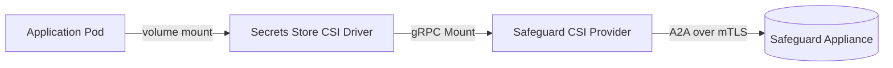

# Safeguard CSI Provider

A provider for the [Kubernetes Secrets Store CSI Driver](https://secrets-store-csi-driver.sigs.k8s.io/)
that retrieves credentials from [One Identity Safeguard for Privileged
Passwords](https://www.oneidentity.com/products/safeguard-for-privileged-passwords/)
and mounts them into pods as files.

Credentials are retrieved over Safeguard's Application-to-Application (A2A)
service using the [safeguard-go](https://github.com/OneIdentity/safeguard-go)
SDK. Authentication is performed with a client certificate; no user password or
long-lived bearer token is stored in the cluster.

## How it works



1. A pod references a `SecretProviderClass` and mounts a `secrets-store.csi.k8s.io`
   volume.
2. The CSI driver calls this provider's gRPC `Mount` endpoint with the class
   attributes and the node-publish secret (the client certificate and key).
3. The provider builds an A2A context with the client certificate, enumerates the
   accounts the certificate is registered to retrieve, filters them by `appName`
   and `accountNames`, and retrieves each account's credential.
4. Each credential is written to the pod's mount as a file named after the
   account, or — in bundle mode — combined into a single JSON file.

## Documentation

| Guide | Description |
| --- | --- |
| [Installation](./docs/installation.md) | Install the driver and provider; flags and compatibility. |
| [Safeguard A2A setup](./docs/safeguard-setup.md) | Configure the A2A registration and client certificate in Safeguard. |
| [Configuration reference](./docs/configuration.md) | Every `SecretProviderClass` parameter and the auth model. |
| [Usage](./docs/usage.md) | Mount secrets, sync to Kubernetes Secrets, retrieve keys/API keys. |
| [Troubleshooting](./docs/troubleshooting.md) | Common errors, logging, rotation behavior. |
| [Development](./docs/development.md) | Build, test, container, and release. |
| [Changelog](./CHANGELOG.md) | Notable changes. |

The sections below are a quick reference; the guides above go deeper.

## SecretProviderClass attributes

| Attribute | Required | Default | Description |
| --- | --- | --- | --- |
| `safeguardHost` | yes | — | Hostname of the Safeguard appliance (e.g. `safeguard.example.com`). |
| `appName` | no | *(all)* | A2A registration application name to filter accounts by. When empty, every account the certificate can retrieve is mounted. |
| `accountNames` | no | *(all)* | Comma-separated account names to mount (case-insensitive), applied in addition to `appName`. Empty mounts every matched account. |
| `objectType` | no | `Password` | Credential type for file-per-account output: `Password`, `PrivateKey`, or `ApiKey`. Applies to all matched accounts. |
| `outputFormat` | no | `file-per-account` | `file-per-account` writes one file per account; `bundle` writes a single JSON file keyed by account name carrying every `objectTypes` value. |
| `objectTypes` | no | value of `objectType` | Comma-separated credential types included per account in bundle mode, e.g. `Password,PrivateKey,ApiKey`. |
| `bundleFile` | no | `secrets.json` | Bundle file name (plain name, no path separators) when `outputFormat: bundle`. |
| `keyFormat` | no | `OpenSsh` | SSH private-key format when a `PrivateKey` is retrieved: `OpenSsh`, `Ssh2`, or `Putty`. Key material is normalized to LF. |
| `safeguardCaBundle` | no | *(system roots)* | PEM CA bundle used to verify the appliance certificate. Set this when the appliance uses a privately issued certificate. |
| `insecureSkipVerify` | no | `false` | When `true`, disables verification of the appliance certificate. **Intended for bootstrapping only — do not use in production.** |

### Node-publish secret

The client certificate and its private key are supplied through the CSI driver's
`nodePublishSecretRef` as two keys:

| Key | Description |
| --- | --- |
| `clientCertificate` | PEM-encoded client certificate (leaf plus any intermediates). |
| `clientKey` | PEM-encoded private key for the client certificate. |

Only PEM material is accepted. If your certificate is in PKCS#12 (`.pfx`/`.p12`),
convert it first:

```bash
openssl pkcs12 -in client.pfx -clcerts -nokeys -out clientCertificate.pem
openssl pkcs12 -in client.pfx -nocerts -nodes -out clientKey.pem
```

## Output

By default (`outputFormat: file-per-account`) each retrieved account produces one
file in the mount, named after the account:

- `objectType: Password` — the file contains the plaintext password.
- `objectType: PrivateKey` — the file contains the SSH private key in the
  requested `keyFormat`, with LF line endings.
- `objectType: ApiKey` — the file contains a JSON array of the account's API key
  credentials (`id`, `name`, `description`, `clientId`, `clientSecret`,
  `clientSecretId`).

With `outputFormat: bundle` the provider instead writes a single JSON file
(`bundleFile`, default `secrets.json`) keyed by account name, where each account
carries every credential type listed in `objectTypes`. This gives higher secret
density (one file, one inotify watch) while still keeping everything in tmpfs and
nothing in etcd. See the
[configuration reference](./docs/configuration.md#bundle-outputformat-bundle) for
the JSON shape and an example.

Safeguard returns SSH key material with Windows CRLF line endings; the provider
normalizes it to LF in both output modes so Linux workloads can consume the
mounted key directly. Passwords are written byte-for-byte.

## Example

Create the node-publish secret from your client certificate and key:

```bash
kubectl create secret generic safeguard-a2a \
  --from-file=clientCertificate=clientCertificate.pem \
  --from-file=clientKey=clientKey.pem
kubectl label secret safeguard-a2a secrets-store.csi.k8s.io/used=true
```

Define a `SecretProviderClass` (see [`examples/`](./examples)):

```yaml
apiVersion: secrets-store.csi.x-k8s.io/v1
kind: SecretProviderClass
metadata:
  name: safeguard
spec:
  provider: safeguard
  parameters:
    safeguardHost: safeguard.example.com
    appName: my-application
    objectType: Password
    # safeguardCaBundle: |
    #   -----BEGIN CERTIFICATE-----
    #   ...appliance issuing CA...
    #   -----END CERTIFICATE-----
```

Mount it into a pod:

```yaml
volumes:
  - name: secrets
    csi:
      driver: secrets-store.csi.k8s.io
      readOnly: true
      volumeAttributes:
        secretProviderClass: safeguard
      nodePublishSecretRef:
        name: safeguard-a2a
```

## Installation

The provider runs as a `DaemonSet` alongside the Secrets Store CSI Driver. Install
with the bundled Helm chart:

```bash
helm install safeguard-csi-provider ./charts/safeguard-csi-provider
```

Or apply the raw manifests in [`deployment/`](./deployment).

The Secrets Store CSI Driver must be installed separately; see its
[installation guide](https://secrets-store-csi-driver.sigs.k8s.io/getting-started/installation).

## Building

Requires Go 1.21 or newer.

```bash
make build          # linux/amd64 binary in _output/
make build-windows  # windows binary
make unit-test      # run unit tests
make container      # build the container image
```

Released images are published to
`ghcr.io/oneidentity/safeguard-csi-provider` as a single multi-arch manifest
covering `linux/amd64`, `linux/arm64`, and `windows/amd64` (nanoserver).

## Releasing

The release version lives in exactly one place: the chart's `appVersion`
([`Chart.yaml`](./charts/safeguard-csi-provider/Chart.yaml)). The chart image
tags inherit it, and CI fails a build whose manifests disagree with it
(`scripts/check-versions.sh`), so nothing has to be hand-synced.

Releases are built and published by the Azure DevOps pipeline
([`azure-pipelines.yml`](./azure-pipelines.yml)). Pushing a `vX.Y.Z` tag:

- builds the multi-arch image and pushes
  `ghcr.io/oneidentity/safeguard-csi-provider:X.Y.Z` (and moves `:latest`),
- packages the Helm chart (`safeguard-csi-provider-X.Y.Z.tgz`) and renders a
  standalone install manifest (`safeguard-csi-provider-X.Y.Z.yaml`), both
  stamped with the tag version so they match the image by construction, and
- creates the GitHub Release with those two files attached.

Every other trigger — pull requests, manual runs, and merges to
`main`/`release-*` — only builds, lints, and tests; nothing is published to
ghcr.io unless a tag is pushed.

**To cut a release you do not edit any file** — the tag is authoritative and
stamps the image and both release artifacts on its own. The versions checked
into the tree (`appVersion` plus the standalone [`deployment/`](./deployment)
manifests, which are plain YAML and cannot template a value) are only a
development baseline for installing straight from a source checkout. They are
deliberately not required to match the next tag; the drift guard just keeps
them internally consistent. When you *do* want the baseline to track the latest
release, bump it in one step instead of editing each file by hand:

```bash
scripts/check-versions.sh --set-version 0.4.0   # sets appVersion + aligns manifests
scripts/check-versions.sh --fix                 # re-align the manifests to appVersion
scripts/check-versions.sh                        # verify (what CI runs)
```

## Development

```bash
go build ./...
go test ./...
go vet ./...
```

Unit tests exercise the mount path against a hermetic in-process A2A appliance,
so no live Safeguard appliance is required.

## License

Licensed under the [Apache License, Version 2.0](./LICENSE). See [NOTICE](./NOTICE).
